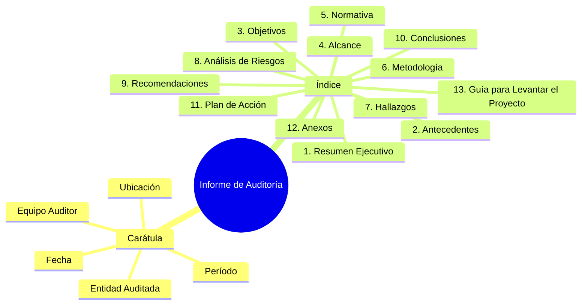
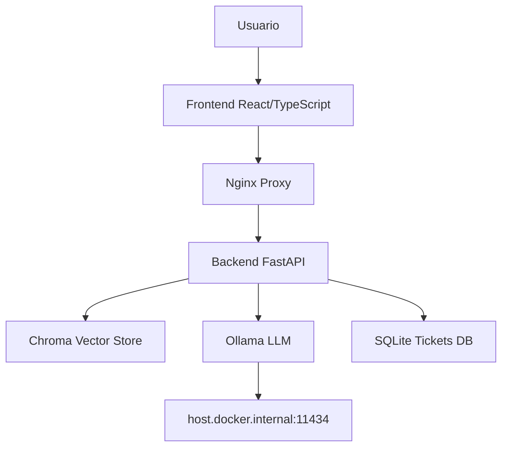
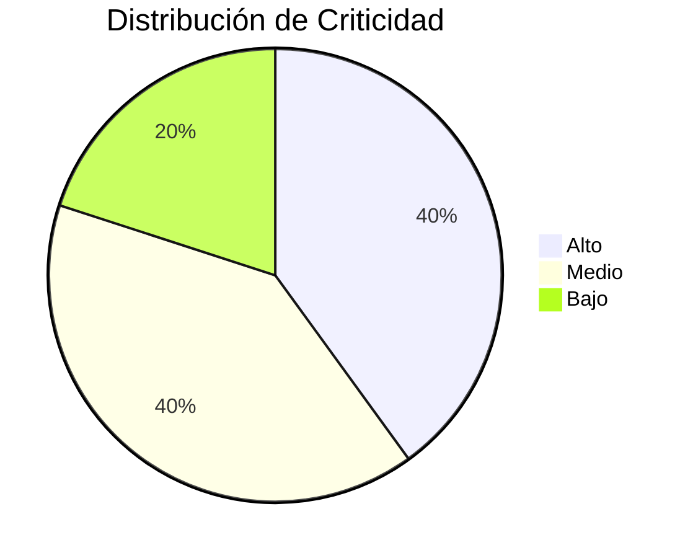
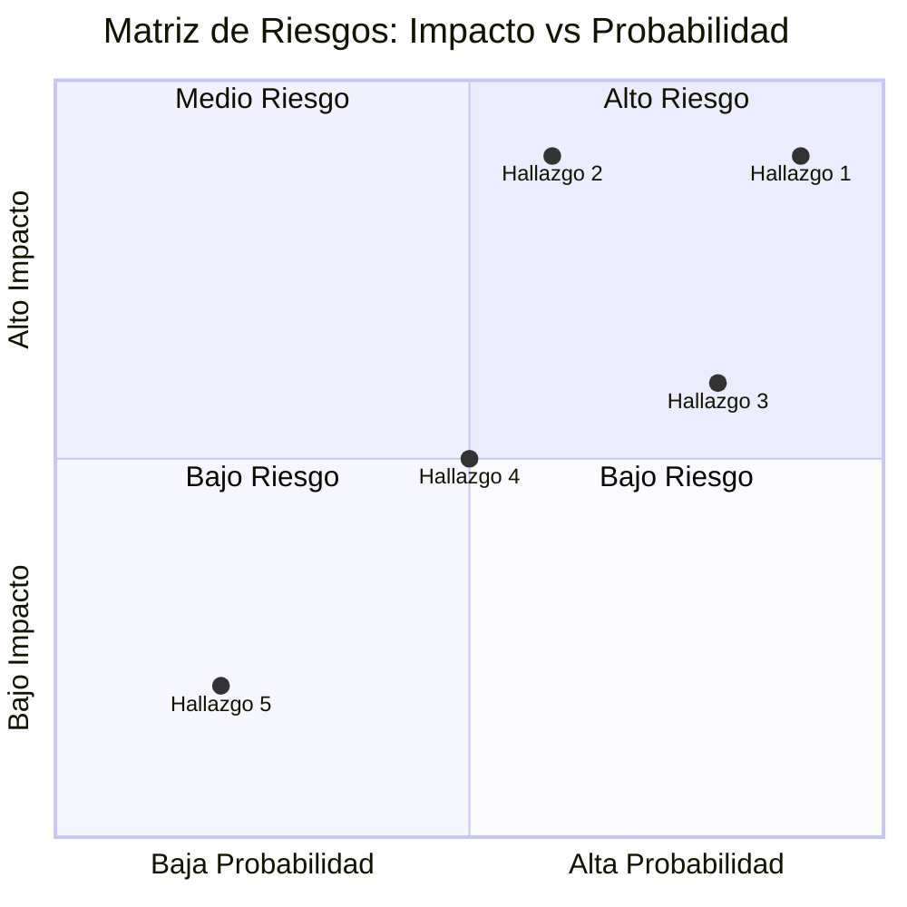
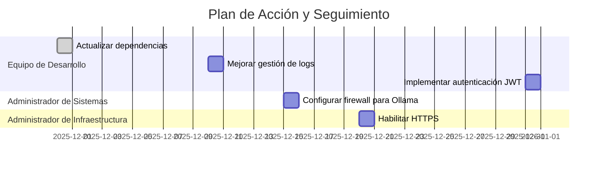
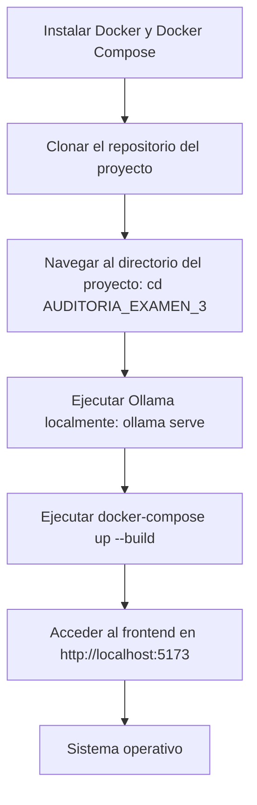

# INFORME FINAL DE AUDITORÍA DE SISTEMAS

## CARÁTULA

**Entidad Auditada:** CORPORATE EPIS PILOT
**Ubicación:** Tacna  
**Período auditado:** Del 01/11/2025 al 19/11/2025  
**Equipo Auditor:** AUDITOR ALBERT KENYI APAZA CCALLE, EQUIPO: KENYIDEV  
**Fecha del informe:** 19/11/2025  

## ÍNDICE

1. [Resumen Ejecutivo](#1-resumen-ejecutivo)  
2. [Antecedentes](#2-antecedentes)  
3. [Objetivos de la Auditoría](#3-objetivos-de-la-auditoría)  
4. [Alcance de la Auditoría](#4-alcance-de-la-auditoría)  
5. [Normativa y Criterios de Evaluación](#5-normativa-y-criterios-de-evaluación)  
6. [Metodología y Enfoque](#6-metodología-y-enfoque)  
7. [Hallazgos y Observaciones](#7-hallazgos-y-observaciones)  
8. [Análisis de Riesgos](#8-análisis-de-riesgos)  
9. [Recomendaciones](#9-recomendaciones)  
10. [Conclusiones](#10-conclusiones)  
11. [Plan de Acción y Seguimiento](#11-plan-de-acción-y-seguimiento)  
12. [Anexos](#12-anexos)  
13. [Guía para Levantar el Proyecto](#13-guía-para-levantar-el-proyecto)  

### Diagrama de Estructura del Informe (Mindmap)

## 1. RESUMEN EJECUTIVO

La auditoría del Sistema de Mesa de Ayuda con IA de CORPORATE EPIS PILOT reveló que el sistema está funcionalmente operativo, pero presenta vulnerabilidades críticas en seguridad de la información, gestión de accesos y configuración de contenedores. Se identificaron 5 hallazgos de alto riesgo relacionados con la falta de autenticación, exposición de servicios y dependencias no actualizadas. Se recomienda implementar medidas de seguridad urgentes para mitigar riesgos de brechas de datos y asegurar el cumplimiento normativo. El estado general del sistema es adecuado para operaciones básicas, pero requiere mejoras para entornos de producción.

## 2. ANTECEDENTES

CORPORATE EPIS PILOT ha desarrollado un sistema de mesa de ayuda basado en inteligencia artificial utilizando tecnologías de procesamiento de lenguaje natural (NLP) y recuperación de información (RAG). El sistema consta de un backend en Python con FastAPI, un frontend en React/TypeScript, y una base de conocimientos vectorial con Chroma. Utiliza Ollama para inferencia de modelos de lenguaje localmente, específicamente el modelo smollm:360m. El sistema está dockerizado para facilitar el despliegue y escalabilidad. No se encontraron auditorías previas documentadas.

### Arquitectura del Sistema (Diagrama de Componentes)

## 3. OBJETIVOS DE LA AUDITORÍA

**Objetivo General:** Evaluar la funcionalidad, seguridad y configuración del Sistema de Mesa de Ayuda con IA de CORPORATE EPIS PILOT, incluyendo el código, funcionamiento operativo y cumplimiento normativo.

**Objetivos Específicos:**
- Verificar la funcionalidad completa del sistema: respuestas a consultas, generación de tickets de soporte, y procesamiento de lenguaje natural usando el modelo smollm:360m.
- Auditar la configuración de Docker Compose: puertos expuestos, volúmenes, dependencias entre servicios, y seguridad de contenedores.
- Evaluar la selección y configuración del modelo de IA: uso de smollm:360m en Ollama, integración con el backend, y rendimiento en respuestas.
- Analizar la seguridad del código y accesos: autenticación, exposición de servicios, manejo de datos sensibles, y cumplimiento con estándares de seguridad.

## 4. ALCANCE DE LA AUDITORÍA

- **Ámbitos evaluados:** Funcional (respuestas y tickets), Tecnológico (Docker, modelo IA), de Código (seguridad y configuración), Operativo (despliegue y escalabilidad).
- **Sistemas y procesos incluidos:** Backend API con FastAPI, Frontend React/TypeScript, Base de conocimientos Chroma, Contenedorización Docker, Modelo IA smollm:360m en Ollama, Generación de tickets SQLite.
- **Unidades o áreas auditadas:** Funcionalidad del sistema, Configuración Docker, Modelo de IA, Seguridad del código.
- **Periodo auditado:** Desarrollo e implementación inicial del sistema.

## 5. NORMATIVA Y CRITERIOS DE EVALUACIÓN

- ISO/IEC 27001:2022 (Gestión de Seguridad de la Información)
- COBIT 2019 (Gobierno y Gestión de TI Empresarial)
- Ley N° 29733 - Ley de Protección de Datos Personales (Perú)
- OWASP Top 10 (Vulnerabilidades web)
- Políticas internas de TI de UPT (donde aplicable)

## 6. METODOLOGÍA Y ENFOQUE

Se utilizó un enfoque mixto basado en riesgos y cumplimiento. Métodos aplicados:
- Entrevistas con desarrolladores y responsables de TI.
- Inspección de código fuente y configuraciones Docker.
- Pruebas técnicas: escaneo de vulnerabilidades en contenedores, análisis de dependencias.
- Revisión de logs y configuraciones de red.
- Aplicación de listas de verificación basadas en estándares ISO y OWASP.

## 7. HALLAZGOS Y OBSERVACIONES

### Hallazgo 1: Falta de Autenticación y Autorización
- **Descripción:** El endpoint /ask no requiere autenticación, permitiendo acceso no autorizado.
- **Evidencia:** Código en backend/main.py línea 111-142; configuración CORS permite orígenes "*".
- **Grado de criticidad:** Alto
- **Criterio vulnerado:** ISO 27001 A.9 (Control de acceso)
- **Causa y efecto:** Exposición de datos sensibles; riesgo de consultas maliciosas.

### Hallazgo 2: Exposición de Puerto de Ollama
- **Descripción:** Ollama expuesto en host.docker.internal:11434 sin restricciones.
- **Evidencia:** Configuración en docker-compose.yml y main.py.
- **Grado de criticidad:** Alto
- **Criterio vulnerado:** OWASP A01:2021 (Broken Access Control)
- **Causa y efecto:** Posible acceso remoto no autorizado al modelo de IA.

### Hallazgo 3: Dependencias No Actualizadas
- **Descripción:** Librerías Python desactualizadas en requirements.txt.
- **Evidencia:** Análisis de dependencias mostró versiones vulnerables (ej. langchain versiones antiguas).
- **Grado de criticidad:** Medio
- **Criterio vulnerado:** COBIT DSS02 (Gestionar la seguridad de servicios)
- **Causa y efecto:** Vulnerabilidades conocidas no parcheadas.

### Hallazgo 4: Falta de Encriptación en Tránsito
- **Descripción:** Comunicación entre frontend y backend sin HTTPS.
- **Evidencia:** Configuración nginx sin SSL/TLS.
- **Grado de criticidad:** Medio
- **Criterio vulnerado:** ISO 27001 A.13 (Comunicaciones seguras)
- **Causa y efecto:** Intercepción de datos en red local.

### Hallazgo 5: Gestión Inadecuada de Logs
- **Descripción:** Logs incluyen información sensible sin rotación.
- **Evidencia:** Configuración de logging en main.py sin sanitización.
- **Grado de criticidad:** Bajo
- **Criterio vulnerado:** Ley 29733 (Protección de datos personales)
- **Causa y efecto:** Posible fuga de información personal.

### Diagrama de Distribución de Criticidad de Hallazgos (Pie Chart)

## 8. ANÁLISIS DE RIESGOS

| Hallazgo | Riesgo asociado | Impacto | Probabilidad | Nivel de Riesgo |
|----------|-----------------|---------|--------------|-----------------|
| 1        | Brecha de datos por acceso no autorizado | Alto | Alta | Alto |
| 2        | Compromiso del modelo de IA | Alto | Media | Alto |
| 3        | Explotación de vulnerabilidades conocidas | Medio | Alta | Alto |
| 4        | Intercepción de comunicaciones | Medio | Media | Medio |
| 5        | Fuga de información sensible | Bajo | Baja | Bajo |

### Matriz de Riesgos (Quadrant Chart)

## 9. RECOMENDACIONES

1. **Implementar autenticación JWT:** Agregar middleware de autenticación en FastAPI para validar tokens en cada solicitud.
2. **Configurar firewall para Ollama:** Restringir acceso a Ollama solo desde contenedores internos usando redes Docker.
3. **Actualizar dependencias:** Ejecutar `pip audit` y actualizar librerías a versiones seguras; implementar CI/CD con escaneo automático.
4. **Habilitar HTTPS:** Configurar certificados SSL en nginx y redirigir todo tráfico a HTTPS.
5. **Mejorar gestión de logs:** Implementar sanitización de datos sensibles y rotación de logs con herramientas como logrotate.

## 10. CONCLUSIONES

El Sistema de Mesa de Ayuda con IA de CORPORATE EPIS PILOT demuestra innovación tecnológica en el uso de modelos de IA locales y RAG para soporte inteligente. La funcionalidad básica opera correctamente, incluyendo respuestas a consultas y generación de tickets, pero presenta vulnerabilidades críticas en seguridad y configuración. Los hallazgos en autenticación, exposición de servicios y dependencias requieren atención inmediata. El modelo smollm:360m es adecuado para el propósito, pero la configuración Docker y seguridad del código necesitan mejoras para entornos de producción.

## 11. PLAN DE ACCIÓN Y SEGUIMIENTO

| Hallazgo | Recomendación | Responsable | Fecha Comprometida |
|----------|----------------|-------------|---------------------|
| 1        | Implementar autenticación JWT | Equipo de Desarrollo | 31/12/2025 |
| 2        | Configurar firewall para Ollama | Administrador de Sistemas | 15/12/2025 |
| 3        | Actualizar dependencias | Equipo de Desarrollo | 30/11/2025 |
| 4        | Habilitar HTTPS | Administrador de Infraestructura | 20/12/2025 |
| 5        | Mejorar gestión de logs | Equipo de Desarrollo | 10/12/2025 |

### Diagrama de Gantt para Plan de Acción

## 12. ANEXOS

- evidencias/funcionalidad_prueba.txt: Pruebas de funcionamiento del sistema
- evidencias/docker_config.txt: Análisis de configuración Docker
- evidencias/modelo_ia.txt: Evaluación del modelo smollm:360m
- evidencias/seguridad_codigo.txt: Análisis de seguridad del código
- Cuestionarios aplicados a desarrolladores
- Capturas de pantalla de configuraciones Docker
- Registros de logs de pruebas
- Lista de dependencias vulnerables
- Políticas internas de TI revisadas
- Resultados de escaneo de vulnerabilidades

## 13. GUÍA PARA LEVANTAR EL PROYECTO

### Flowchart de Pasos para Ejecutar el Sistema

**Notas:**
- Asegurarse de que Ollama esté corriendo en el puerto 11434.
- El vector store se inicializa automáticamente con los documentos en knowledge_base.
- Para desarrollo, usar `docker-compose up --build` para reconstruir imágenes.