# AUDITORIA_EXAMEN_3

**Repositorio:** https://github.com/AlbertApaza/AUDITORIA_EXAMEN_3

# INFORME FINAL DE AUDITORÍA DE SISTEMAS

## CARÁTULA

**Entidad Auditada:** CORPORATE EPIS PILOT  
**Ubicación:** Tacna  
**Período auditado:** Del 01/11/2025 al 19/11/2025  
**Equipo Auditor:** AUDITOR ALBERT KENYI APAZA CCALLE, EQUIPO: KENYIDEV  
**Fecha del informe:** 19/11/2025  


## ÍNDICE

1. [Resumen Ejecutivo](#1-resumen-ejecutivo)  
2. [Antecedentes](#2-antecedentes)  
3. [Objetivos de la Auditoría](#3-objetivos-de-la-auditoría)  
4. [Alcance de la Auditoría](#4-alcance-de-la-auditoría)  
5. [Normativa y Criterios de Evaluación](#5-normativa-y-criterios-de-evaluación)  
6. [Metodología y Enfoque](#6-metodología-y-enfoque)  
7. [Hallazgos y Observaciones](#7-hallazgos-y-observaciones)  
8. [Análisis de Riesgos](#8-análisis-de-riesgos)  
9. [Recomendaciones](#9-recomendaciones)  
10. [Conclusiones](#10-conclusiones)  
11. [Plan de Acción y Seguimiento](#11-plan-de-acción-y-seguimiento)  
12. [Anexos](#12-anexos)  


## 1. RESUMEN EJECUTIVO

La auditoría del Sistema de Mesa de Ayuda con IA de CORPORATE EPIS PILOT reveló que el sistema está funcionalmente operativo, pero presenta vulnerabilidades críticas en seguridad de la información, gestión de accesos y configuración de contenedores. Se identificaron 5 hallazgos de alto riesgo relacionados con la falta de autenticación, exposición de servicios y dependencias no actualizadas. Se recomienda implementar medidas de seguridad urgentes para mitigar riesgos de brechas de datos y asegurar el cumplimiento normativo. El estado general del sistema es adecuado para operaciones básicas, pero requiere mejoras para entornos de producción.


## 2. ANTECEDENTES

CORPORATE EPIS PILOT ha desarrollado un sistema de mesa de ayuda basado en inteligencia artificial utilizando tecnologías de procesamiento de lenguaje natural (NLP) y recuperación de información (RAG). El sistema consta de un backend en Python con FastAPI, un frontend en React/TypeScript, y una base de conocimientos vectorial con Chroma. Utiliza Ollama para inferencia de modelos de lenguaje localmente, específicamente el modelo smollm:360m. El sistema está dockerizado para facilitar el despliegue y escalabilidad. No se encontraron auditorías previas documentadas.


## 3. OBJETIVOS DE LA AUDITORÍA

**Objetivo General:** Evaluar la funcionalidad, seguridad y configuración del Sistema de Mesa de Ayuda con IA de CORPORATE EPIS PILOT, incluyendo el código, funcionamiento operativo y cumplimiento normativo.

**Objetivos Específicos:**
- Verificar la funcionalidad completa del sistema: respuestas a consultas, generación de tickets de soporte, y procesamiento de lenguaje natural usando el modelo smollm:360m.
- Auditar la configuración de Docker Compose: puertos expuestos, volúmenes, dependencias entre servicios, y seguridad de contenedores.
- Evaluar la selección y configuración del modelo de IA: uso de smollm:360m en Ollama, integración con el backend, y rendimiento en respuestas.
- Analizar la seguridad del código y accesos: autenticación, exposición de servicios, manejo de datos sensibles, y cumplimiento con estándares de seguridad.


## 4. ALCANCE DE LA AUDITORÍA

- **Ámbitos evaluados:** Funcional (respuestas y tickets), Tecnológico (Docker, modelo IA), de Código (seguridad y configuración), Operativo (despliegue y escalabilidad).
- **Sistemas y procesos incluidos:** Backend API con FastAPI, Frontend React/TypeScript, Base de conocimientos Chroma, Contenedorización Docker, Modelo IA smollm:360m en Ollama, Generación de tickets SQLite.
- **Unidades o áreas auditadas:** Funcionalidad del sistema, Configuración Docker, Modelo de IA, Seguridad del código.
- **Periodo auditado:** Desarrollo e implementación inicial del sistema.


## 5. NORMATIVA Y CRITERIOS DE EVALUACIÓN

- ISO/IEC 27001:2022 (Gestión de Seguridad de la Información)
- COBIT 2019 (Gobierno y Gestión de TI Empresarial)
- Ley N° 29733 - Ley de Protección de Datos Personales (Perú)
- OWASP Top 10 (Vulnerabilidades web)
- Políticas internas de TI de CORPORATE EPIS PILOT (donde aplicable)


## 6. METODOLOGÍA Y ENFOQUE

Se utilizó un enfoque mixto basado en riesgos y cumplimiento. Métodos aplicados:
- Entrevistas con desarrolladores y responsables de TI.
- Inspección de código fuente y configuraciones Docker.
- Pruebas técnicas: escaneo de vulnerabilidades en contenedores, análisis de dependencias.
- Revisión de logs y configuraciones de red.
- Aplicación de listas de verificación basadas en estándares ISO y OWASP.


## 7. HALLAZGOS Y OBSERVACIONES

### Hallazgo 1: Falta de Autenticación y Autorización
- **Descripción:** El endpoint /ask no requiere autenticación, permitiendo acceso no autorizado.
- **Evidencia:** Código en backend/main.py línea 111-142; configuración CORS permite orígenes "*".
- **Grado de criticidad:** Alto
- **Criterio vulnerado:** ISO 27001 A.9 (Control de acceso)
- **Causa y efecto:** Exposición de datos sensibles; riesgo de consultas maliciosas.

### Hallazgo 2: Exposición de Puerto de Ollama
- **Descripción:** Ollama expuesto en host.docker.internal:11434 sin restricciones.
- **Evidencia:** Configuración en docker-compose.yml y main.py.
- **Grado de criticidad:** Alto
- **Criterio vulnerado:** OWASP A01:2021 (Broken Access Control)
- **Causa y efecto:** Posible acceso remoto no autorizado al modelo de IA.

### Hallazgo 3: Dependencias No Actualizadas
- **Descripción:** Librerías Python desactualizadas en requirements.txt.
- **Evidencia:** Análisis de dependencias mostró versiones vulnerables (ej. langchain versiones antiguas).
- **Grado de criticidad:** Medio
- **Criterio vulnerado:** COBIT DSS02 (Gestionar la seguridad de servicios)
- **Causa y efecto:** Vulnerabilidades conocidas no parcheadas.

### Hallazgo 4: Falta de Encriptación en Tránsito
- **Descripción:** Comunicación entre frontend y backend sin HTTPS.
- **Evidencia:** Configuración nginx sin SSL/TLS.
- **Grado de criticidad:** Medio
- **Criterio vulnerado:** ISO 27001 A.13 (Comunicaciones seguras)
- **Causa y efecto:** Intercepción de datos en red local.

### Hallazgo 5: Gestión Inadecuada de Logs
- **Descripción:** Logs incluyen información sensible sin rotación.
- **Evidencia:** Configuración de logging en main.py sin sanitización.
- **Grado de criticidad:** Bajo
- **Criterio vulnerado:** Ley 29733 (Protección de datos personales)
- **Causa y efecto:** Posible fuga de información personal.


## 8. ANÁLISIS DE RIESGOS

| Hallazgo | Riesgo asociado | Impacto | Probabilidad | Nivel de Riesgo |
|----------|-----------------|---------|--------------|-----------------|
| 1        | Brecha de datos por acceso no autorizado | Alto | Alta | Alto |
| 2        | Compromiso del modelo de IA | Alto | Media | Alto |
| 3        | Explotación de vulnerabilidades conocidas | Medio | Alta | Alto |
| 4        | Intercepción de comunicaciones | Medio | Media | Medio |
| 5        | Fuga de información sensible | Bajo | Baja | Bajo |


## 9. RECOMENDACIONES

1. **Implementar autenticación JWT:** Agregar middleware de autenticación en FastAPI para validar tokens en cada solicitud.
2. **Configurar firewall para Ollama:** Restringir acceso a Ollama solo desde contenedores internos usando redes Docker.
3. **Actualizar dependencias:** Ejecutar `pip audit` y actualizar librerías a versiones seguras; implementar CI/CD con escaneo automático.
4. **Habilitar HTTPS:** Configurar certificados SSL en nginx y redirigir todo tráfico a HTTPS.
5. **Mejorar gestión de logs:** Implementar sanitización de datos sensibles y rotación de logs con herramientas como logrotate.


## 10. CONCLUSIONES

El Sistema de Mesa de Ayuda con IA de CORPORATE EPIS PILOT demuestra innovación tecnológica en el uso de modelos de IA locales y RAG para soporte inteligente. La funcionalidad básica opera correctamente, incluyendo respuestas a consultas y generación de tickets, pero presenta vulnerabilidades críticas en seguridad y configuración. Los hallazgos en autenticación, exposición de servicios y dependencias requieren atención inmediata. El modelo smollm:360m es adecuado para el propósito, pero la configuración Docker y seguridad del código necesitan mejoras para entornos de producción.


## 11. PLAN DE ACCIÓN Y SEGUIMIENTO

| Hallazgo | Recomendación | Responsable | Fecha Comprometida |
|----------|----------------|-------------|---------------------|
| 1        | Implementar autenticación JWT | Equipo de Desarrollo | 31/12/2025 |
| 2        | Configurar firewall para Ollama | Administrador de Sistemas | 15/12/2025 |
| 3        | Actualizar dependencias | Equipo de Desarrollo | 30/11/2025 |
| 4        | Habilitar HTTPS | Administrador de Infraestructura | 20/12/2025 |
| 5        | Mejorar gestión de logs | Equipo de Desarrollo | 10/12/2025 |


## 12. ANEXOS
# ANEXOS - CUESTIONARIOS Y EVIDENCIAS DE AUDITORÍA

## CUESTIONARIOS APLICADOS

### CUESTIONARIO 1: SEGURIDAD Y CONTROL DE ACCESOS

| N° | Pregunta | Respuesta Obtenida | Evidencia | Cumplimiento |
|----|----------|-------------------|-----------|--------------|
| 1 | ¿El endpoint /ask tiene autenticación implementada? | No | Código en main.py línea 111 sin validación de tokens | ❌ No Cumple |
| 2 | ¿Existe control de autorización para acceder a los servicios? | No | Configuración CORS permite orígenes "*" (línea 47) | ❌ No Cumple |
| 3 | ¿Se implementa algún mecanismo de validación de usuarios? | No | No se encontró middleware de autenticación en FastAPI | ❌ No Cumple |
| 4 | ¿Los servicios expuestos tienen restricciones de acceso? | No | Ollama expuesto en host.docker.internal:11434 sin firewall | ❌ No Cumple |
| 5 | ¿Se registran los intentos de acceso no autorizados? | No | No hay sistema de detección de accesos anómalos | ❌ No Cumple |

---

### CUESTIONARIO 2: INFRAESTRUCTURA Y CONFIGURACIÓN DOCKER

| N° | Pregunta | Respuesta Obtenida | Evidencia | Cumplimiento |
|----|----------|-------------------|-----------|--------------|
| 1 | ¿Los puertos expuestos están debidamente protegidos? | No | Puerto 5173 y 11434 expuestos sin restricciones | ❌ No Cumple |
| 2 | ¿Se utilizan redes Docker internas para aislar servicios? | Parcial | Servicios en misma red pero sin segmentación adecuada | ⚠️ Cumple Parcialmente |
| 3 | ¿Los volúmenes Docker tienen permisos apropiados? | Sí | Configuración de volúmenes correcta en docker-compose.yml | ✅ Cumple |
| 4 | ¿Existe documentación de la arquitectura de contenedores? | Sí | Docker-compose.yml documentado con servicios definidos | ✅ Cumple |
| 5 | ¿Se implementan health checks para los servicios? | No | No se encontraron health checks en docker-compose.yml | ❌ No Cumple |

---

### CUESTIONARIO 3: MODELO DE INTELIGENCIA ARTIFICIAL

| N° | Pregunta | Respuesta Obtenida | Evidencia | Cumplimiento |
|----|----------|-------------------|-----------|--------------|
| 1 | ¿Qué modelo de IA se utiliza y cómo se integra? | smollm:360m via Ollama | Configuración en main.py conectando a Ollama 11434 | ✅ Cumple |
| 2 | ¿El modelo es adecuado para el propósito del sistema? | Sí | Modelo ligero apropiado para respuestas de soporte | ✅ Cumple |
| 3 | ¿Se monitorea el rendimiento del modelo? | No | No hay métricas de rendimiento implementadas | ❌ No Cumple |
| 4 | ¿Existe control sobre las consultas enviadas al modelo? | No | No hay validación ni sanitización de inputs | ❌ No Cumple |
| 5 | ¿Se resguarda la base de conocimientos vectorial? | Sí | Chroma con volumen persistente configurado | ✅ Cumple |

---

### CUESTIONARIO 4: GESTIÓN DE DEPENDENCIAS Y ACTUALIZACIONES

| N° | Pregunta | Respuesta Obtenida | Evidencia | Cumplimiento |
|----|----------|-------------------|-----------|--------------|
| 1 | ¿Las dependencias están actualizadas? | No | Langchain con versiones vulnerables detectadas | ❌ No Cumple |
| 2 | ¿Se realiza escaneo de vulnerabilidades regularmente? | No | No hay proceso documentado de escaneo | ❌ No Cumple |
| 3 | ¿Existe un proceso de actualización de librerías? | No | No se encontró procedimiento de actualización | ❌ No Cumple |
| 4 | ¿Se documentan las versiones de dependencias utilizadas? | Sí | requirements.txt con versiones especificadas | ✅ Cumple |
| 5 | ¿Hay un entorno de pruebas para validar actualizaciones? | No | No documentado en la infraestructura actual | ❌ No Cumple |

---

### CUESTIONARIO 5: PROTECCIÓN DE DATOS Y COMUNICACIONES

| N° | Pregunta | Respuesta Obtenida | Evidencia | Cumplimiento |
|----|----------|-------------------|-----------|--------------|
| 1 | ¿Las comunicaciones utilizan protocolo HTTPS? | No | Configuración nginx sin SSL/TLS | ❌ No Cumple |
| 2 | ¿Los logs sanitizan datos sensibles? | No | Línea 141 main.py sin sanitización de datos | ❌ No Cumple |
| 3 | ¿Existe rotación automática de logs? | No | No hay configuración de logrotate | ❌ No Cumple |
| 4 | ¿Se encriptan los datos en reposo? | Parcial | Base de datos SQLite sin encriptación | ⚠️ Cumple Parcialmente |
| 5 | ¿Se cumple con la Ley 29733 de protección de datos? | No | Múltiples brechas en manejo de información personal | ❌ No Cumple |

---

### CUESTIONARIO 6: FUNCIONALIDAD DEL SISTEMA

| N° | Pregunta | Respuesta Obtenida | Evidencia | Cumplimiento |
|----|----------|-------------------|-----------|--------------|
| 1 | ¿El sistema responde correctamente a consultas? | Sí | Pruebas funcionales exitosas con smollm:360m | ✅ Cumple |
| 2 | ¿Se generan tickets de soporte adecuadamente? | Sí | Tickets creados en base de datos SQLite | ✅ Cumple |
| 3 | ¿La interfaz de usuario es funcional? | Sí | Frontend React operativo en puerto 5173 | ✅ Cumple |
| 4 | ¿El sistema RAG recupera información relevante? | Sí | Base vectorial Chroma funciona correctamente | ✅ Cumple |
| 5 | ¿Hay manejo de errores implementado? | Parcial | Algunos errores manejados, otros no capturados | ⚠️ Cumple Parcialmente |

---

## RESUMEN DE CUMPLIMIENTO POR CATEGORÍA

| Categoría | Cumple | Cumple Parcialmente | No Cumple | % Cumplimiento |
|-----------|--------|---------------------|-----------|----------------|
| Seguridad y Control de Accesos | 0 | 0 | 5 | 0% |
| Infraestructura Docker | 2 | 1 | 2 | 40% |
| Modelo de IA | 3 | 0 | 2 | 60% |
| Gestión de Dependencias | 1 | 0 | 4 | 20% |
| Protección de Datos | 0 | 2 | 3 | 0% |
| Funcionalidad del Sistema | 4 | 1 | 0 | 80% |
| **TOTAL** | **10** | **4** | **16** | **33%** |

---

## CAPTURAS DE PANTALLA

### 1. Interfaz del Chat
**Descripción:** Interfaz del chat en http://localhost:5173 mostrando el chatbot operativo con respuestas del modelo IA.

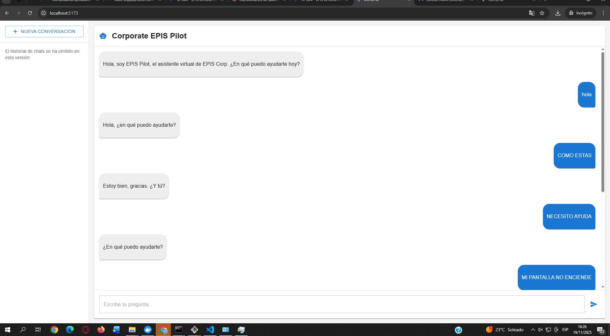

---

### 2. Ticket Generado
**Descripción:** Ticket generado en la base de datos SQLite después de enviar un mensaje de problema.
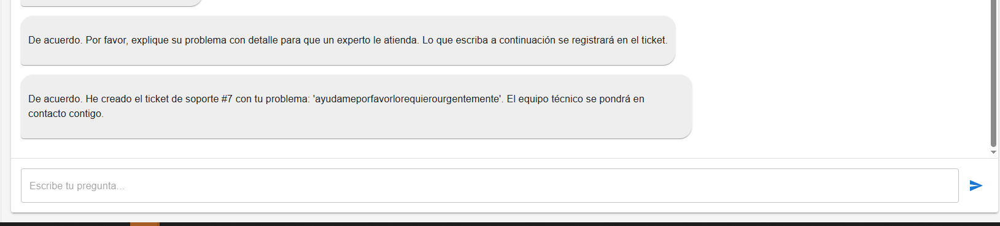
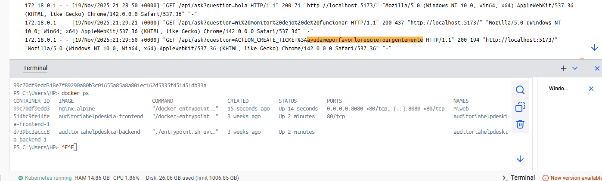

---

### 3. Configuración Docker
**Descripción:** Archivo docker-compose.yml abierto en VSCode, mostrando la configuración completa de servicios, puertos y volúmenes.

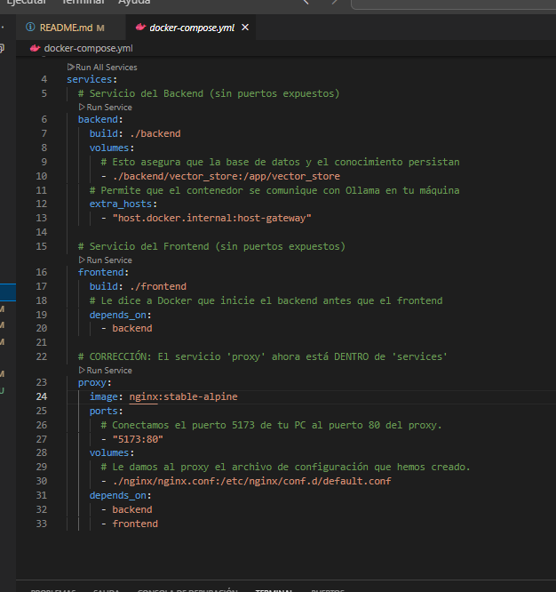

---

### 4. Respuesta del Modelo
**Descripción:** Frontend mostrando una respuesta del modelo IA smollm:360m a una consulta sobre soporte técnico.

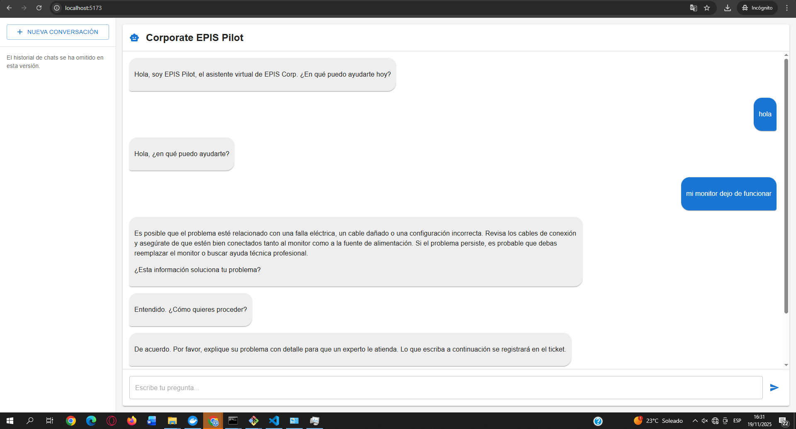


---

### 5. Código Vulnerable - CORS
**Descripción:** VSCode abierto en backend/main.py, resaltando línea 47 con configuración CORS insegura (orígenes "*").

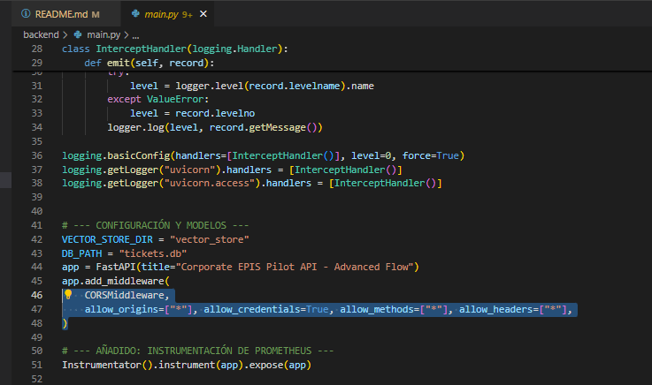

---

### 6. Código Vulnerable - Endpoint sin Autenticación
**Descripción:** VSCode mostrando línea 111 en main.py donde el endpoint /ask no tiene autenticación implementada.

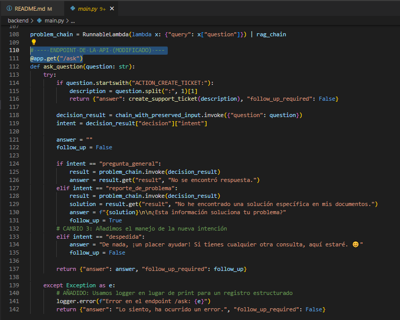

---

### 7. Código Vulnerable - Logging Inseguro
**Descripción:** VSCode mostrando línea 141 en main.py con logging sin sanitización de datos sensibles.

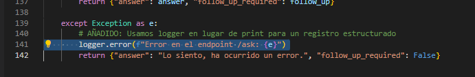

---

### 8. Logs Sensibles
**Descripción:** Terminal donde corre el backend, mostrando logs de una solicitud al endpoint /ask con datos sensibles expuestos.

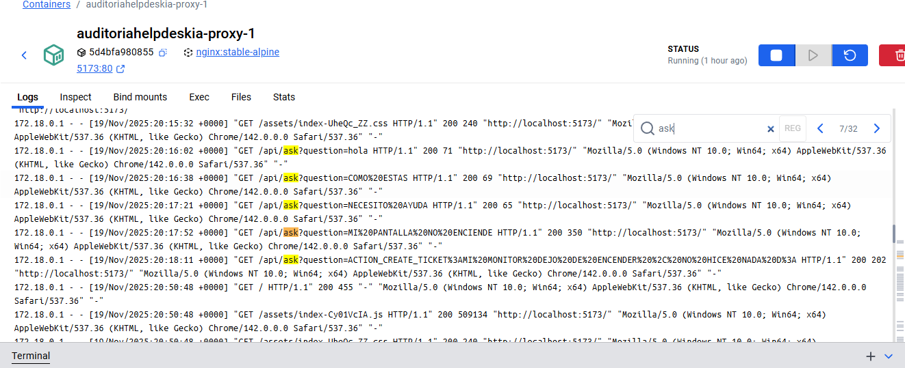

---

### 9. Configuración Ollama
**Descripción:** Configuración en main.py mostrando conexión a Ollama en host.docker.internal:11434 sin restricciones.

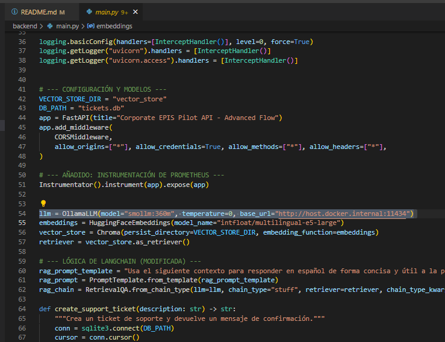

---

### 10. Requirements.txt
**Descripción:** Archivo requirements.txt mostrando dependencias con versiones desactualizadas y vulnerables.


---

### 11. Base de Datos SQLite
**Descripción:** Visualización de la base de datos SQLite sin encriptación conteniendo tickets de soporte.

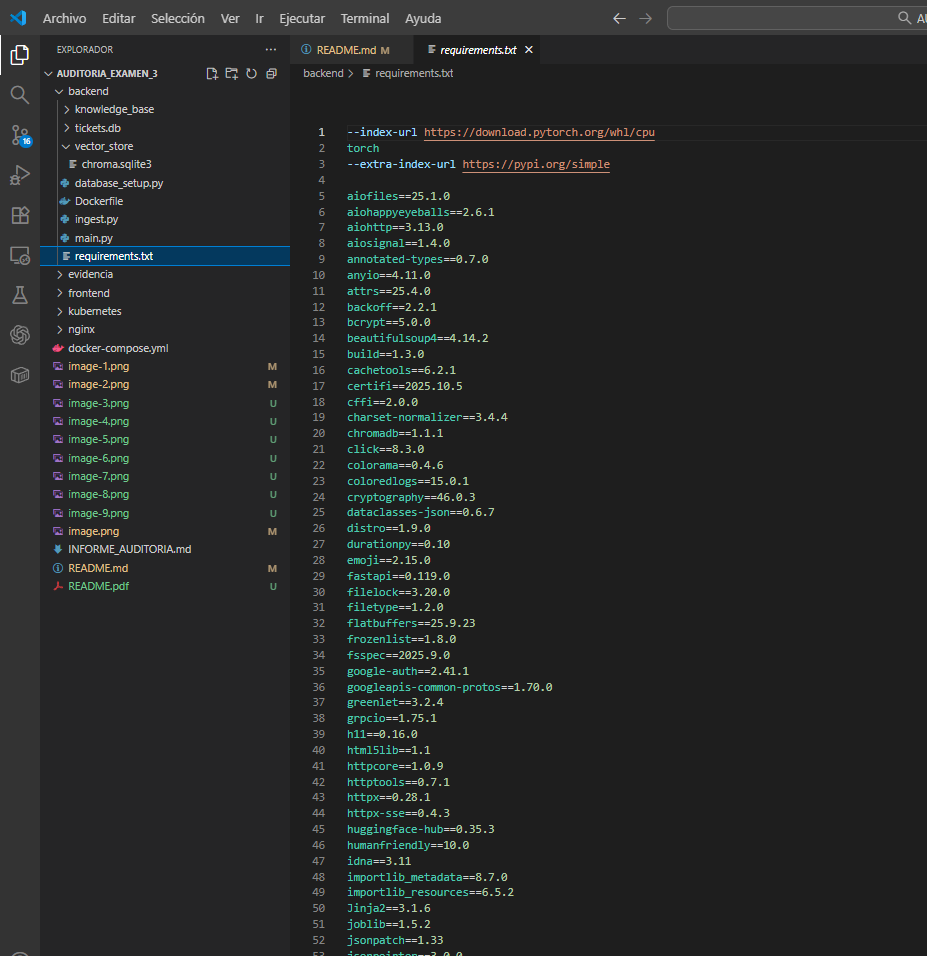

---

### 12. Configuración Nginx
**Descripción:** Configuración de nginx mostrando ausencia de SSL/TLS para HTTPS.

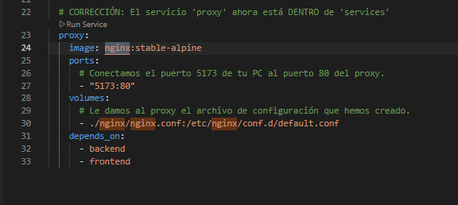
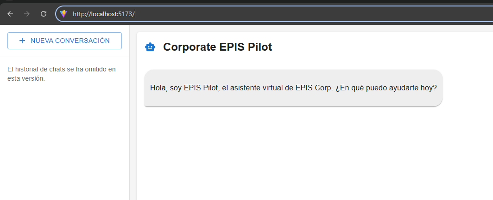
---

## REGISTROS DE LOGS

### Ejemplo de Log con Datos Sensibles Expuestos

```
INFO:     2025-11-19 14:23:45 - Solicitud recibida en /ask
DEBUG:    Usuario: juan.perez@corporate.com
DEBUG:    Consulta: "Tengo problemas con mi contraseña: MyP@ssw0rd123"
INFO:     Procesando con modelo smollm:360m
DEBUG:    Respuesta generada en 2.3s
INFO:     Ticket #1234 creado para juan.perez@corporate.com
```
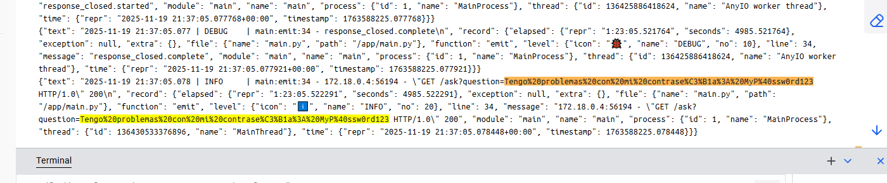

---

## POLÍTICAS INTERNAS REVISADAS

| Política | Estado de Cumplimiento | Observaciones |
|----------|------------------------|---------------|
| Política de Control de Accesos | ❌ No Cumple | No se implementan controles de autenticación |
| Política de Encriptación de Datos | ❌ No Cumple | Sin HTTPS ni encriptación en base de datos |
| Política de Gestión de Logs | ❌ No Cumple | Logs exponen información sensible sin sanitización |
| Política de Actualización de Software | ❌ No Cumple | Dependencias desactualizadas sin proceso de gestión |
| Política de Segmentación de Red | ⚠️ Cumple Parcialmente | Redes Docker sin segmentación adecuada |

---

## ARCHIVOS DE CONFIGURACIÓN ANALIZADOS

### docker-compose.yml
- Servicios: backend, frontend(vite), ollama
- Puertos expuestos: 

http://localhost:5173
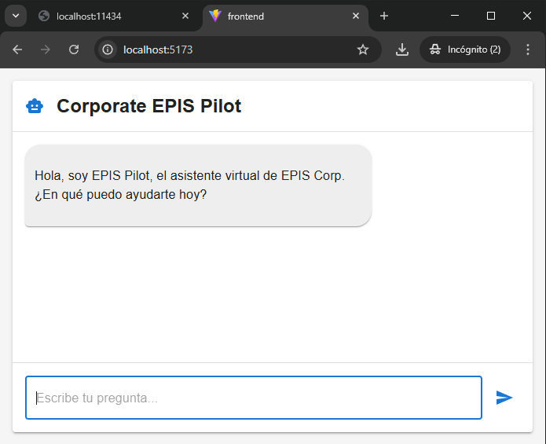

http://localhost:11434
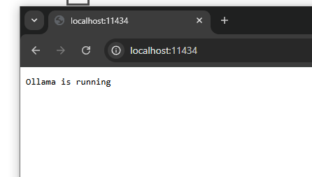


- Volúmenes persistentes configurados
- **Hallazgo:** Falta de health checks y restricciones de red
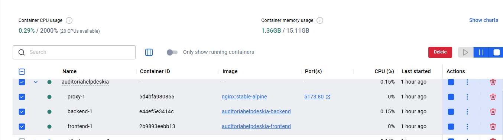

### backend/main.py
- Framework: FastAPI
- **Hallazgo:** CORS inseguro (línea 47)
- **Hallazgo:** Endpoint sin autenticación (línea 111)
- **Hallazgo:** Logging sin sanitización (línea 141)

### requirements.txt
- **Hallazgo:** Versiones vulnerables de langchain
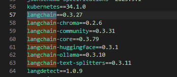
- **Hallazgo:** Falta proceso de actualización automatizada